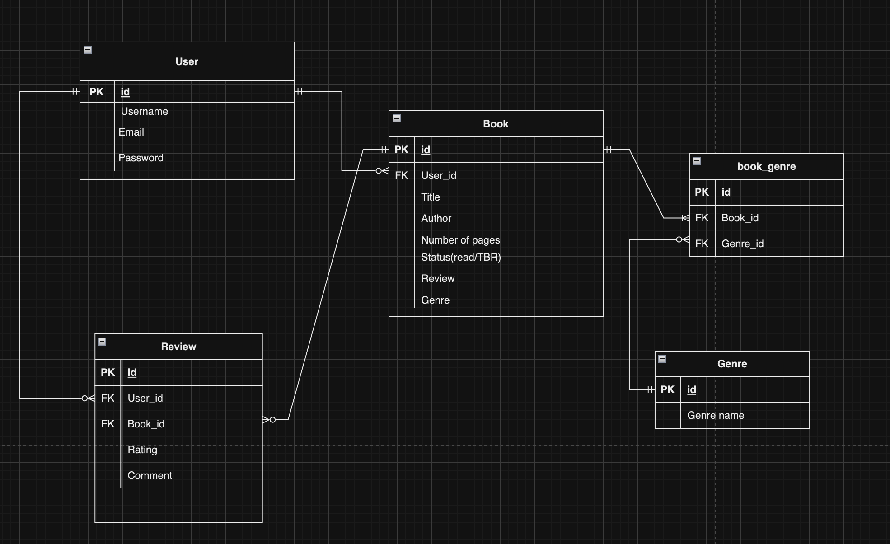

Book Collection Application

This app is designed to give readers or book collectors a way to keep a record of the books they've read or want to read, and sort them while they can also input details like number of pages, reviews, ratings, and genre. It can be hard to keep tract of all the books you own or read so this application helps with organising and keeping a record of books in someone's collection.

